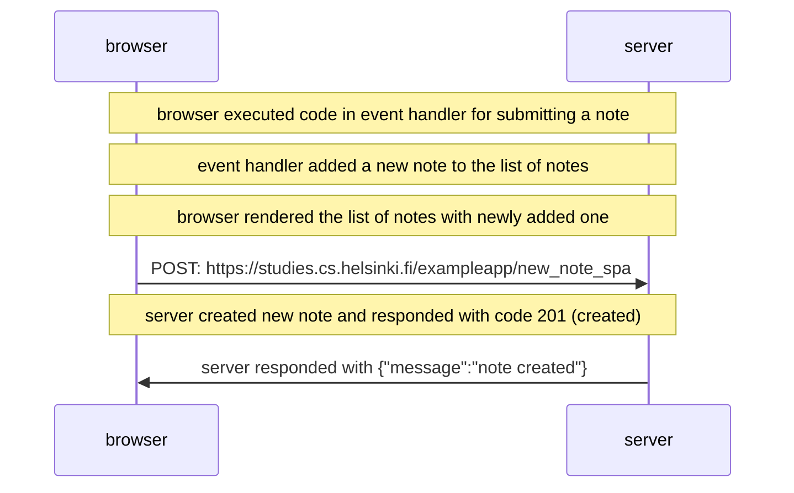

# New note in Single page app diagram

User fill the form with text 'test-note' and press save button

``` mermaid 
sequenceDiagram
participant browser
participant server
Note over browser, server: browser executed code in event handler for submitting a note
Note over browser, server: event handler added a new note to the list of notes
Note over browser, server: browser rendered the list of notes with newly added one
browser->>server: POST: https://studies.cs.helsinki.fi/exampleapp/new_note_spa
Note over browser, server: server created new note and responded with code 201 (created)
server->>browser: server responded with {"message":"note created"}
```
